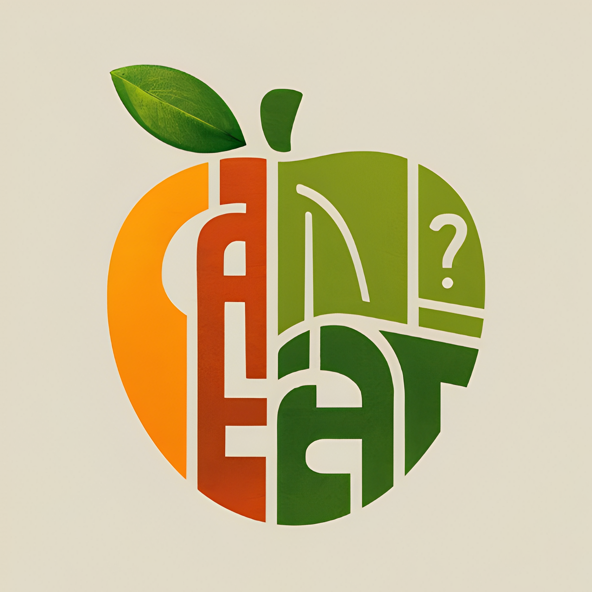

# <ins>CanEat?</ins>
  

  

CanEat? is a mobile application that aims to overcome agriculture problems using Computer Vision Technology. This advanced technology enables simple, automated, and accurate classification of agricultural products based on Image. 

## Group C241-PS257 Member :
* Muhammad Naufal Ramadhan (M009D4KY1657) – Machine Learning – Universitas Gunadarma
* Muhamad Priasmoro (M009D4KY1658) - Machine Learning - Universitas Gunadarma
* Zulian Firmansyah (M466D4KY1829) - Machine Learning - Universitas Sains Alqur'an
* Mohammad Rafly Abbyansyah (C246D4KY0133) - Cloud Computing - Universitas Kuningan
* Cholik Gibran Namora (C246D4KY1271) - Cloud Computing - Universitas Kuningan
* Tegar Putra Pamungkas (A466D4KY3958) - Mobile Development - Universitas Sains Alqur'an 
*  Naufal Ammar Raihan (A466D4KY4584) - Mobile Development - Universitas Sains Alqur'an

## Technologies Used
- [Kotlin](https://kotlinlang.org/)
- [Android Studio](https://developer.android.com/studio)
- [Python](https://docs.python.org/3/)
- [TensorFlow](https://www.tensorflow.org/api_docs)
- [Google Cloud Platform](https://cloud.google.com/?hl=en)
- [Firebase](https://firebase.google.com/)

## Installation
1. Download the APK file from this [Google Drive]()
2. Install the APK file on your Android device.
3. Run the app (you can see the APK demo video on Google Drive)

Or if you want to see our Machine Learning, Cloud Computing, and Mobile Development work, you can explore this Github repository branches

  

